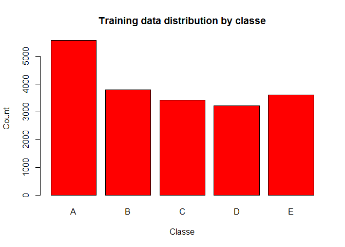
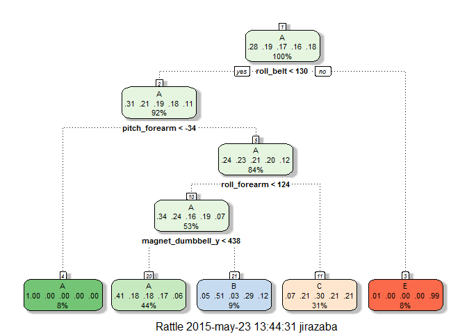

# Study of personal movement using activity monitoring
Jorge Irazabal  
Friday, May 22, 2015  
# Introduction

Using devices such as Jawbone Up, Nike FuelBand, and Fitbit it is now possible to collect a large amount of data about personal activity relatively inexpensively. These type of devices are part of the quantified self movement – a group of enthusiasts who take measurements about themselves regularly to improve their health, to find patterns in their behavior, or because they are tech geeks. One thing that people regularly do is quantify how much of a particular activity they do, but they rarely quantify how well they do it. In this project, your goal will be to use data from accelerometers on the belt, forearm, arm, and dumbell of 6 participants. They were asked to perform barbell lifts correctly and incorrectly in 5 different ways. 

# Data

The training data for this project are available here: [Training Data](https://d396qusza40orc.cloudfront.net/predmachlearn/pml-training.csv)

The test data are available here: [Test](https://d396qusza40orc.cloudfront.net/predmachlearn/pml-testing.csv)

## Loading and cleanind data

First we go to load the data and clean it


```r
# download.file('https://d396qusza40orc.cloudfront.net/predmachlearn/pml-training.csv','training.csv')
training <- read.csv('training.csv')

# download.file('https://d396qusza40orc.cloudfront.net/predmachlearn/pml-testing.csv','testing.csv')
testing <- read.csv('testing.csv')

dim(training)
```

```
## [1] 19622   160
```

The training data has 19622 observations and 160 features


```r
library(caret)
```

```
## Loading required package: lattice
## Loading required package: ggplot2
```

```r
# Quit irrevelant columns, the first seven columns :user_name raw_timestamp_part_1 raw_timestamp_part_2   cvtd_timestamp new_window num_window
training <- training[,-c(1:7)]
testing <- testing[,-c(1:7)]
# Delete columns with all missing values
training<-training[,colSums(is.na(training)) == 0]
# Delete near zero variance columns
nzvColums <- nearZeroVar(training)
training <- training[, -nzvColums]
dim(training)
```

```
## [1] 19622    53
```

After quit irrevelant and null columns, we have 53 valid features.

Now, let's partition training data for cross-validation (60% for training and 40% for test)

```r
#random seed
set.seed(123456)

trainingPartition <- createDataPartition(y=training$classe, p=0.6, list=FALSE)
trainingTrain <- training[trainingPartition, ] 
trainingTest <- training[-trainingPartition, ]

# Data distribution by classe
plot(training$classe, main="Training data distribution by classe", 
     xlab="Classe", ylab="Count", col="red")
```

 

# Prediction Models

We use two different prediction methods: Decision Tree and Random Forest

## Decision Tree

```r
# Load libraries
library(rpart) 
library(rattle)
```

```
## Rattle: A free graphical interface for data mining with R.
## Versión 3.4.1 Copyright (c) 2006-2014 Togaware Pty Ltd.
## Escriba 'rattle()' para agitar, sacudir y  rotar sus datos.
```

```r
library(parallel)
library(doParallel)
```

```
## Loading required package: foreach
## Loading required package: iterators
```

```r
#parallel computing for multi-core
registerDoParallel(makeCluster(detectCores()))

modelTree <- train(classe ~ .,method="rpart",data=trainingTrain)
print(modelTree$finalModel)
```

```
## n= 11776 
## 
## node), split, n, loss, yval, (yprob)
##       * denotes terminal node
## 
##  1) root 11776 8428 A (0.28 0.19 0.17 0.16 0.18)  
##    2) roll_belt< 130.5 10795 7455 A (0.31 0.21 0.19 0.18 0.11)  
##      4) pitch_forearm< -34.35 932    3 A (1 0.0032 0 0 0) *
##      5) pitch_forearm>=-34.35 9863 7452 A (0.24 0.23 0.21 0.2 0.12)  
##       10) roll_forearm< 123.5 6265 4109 A (0.34 0.24 0.16 0.19 0.068)  
##         20) magnet_dumbbell_y< 437.5 5154 3048 A (0.41 0.18 0.18 0.17 0.056) *
##         21) magnet_dumbbell_y>=437.5 1111  549 B (0.045 0.51 0.032 0.29 0.12) *
##       11) roll_forearm>=123.5 3598 2532 C (0.071 0.21 0.3 0.21 0.21) *
##    3) roll_belt>=130.5 981    8 E (0.0082 0 0 0 0.99) *
```

```r
predictTree <- predict(modelTree, trainingTest)

# Plot of the Decision Tree
fancyRpartPlot(modelTree$finalModel)
```

 

```r
# Show Results
confusionMatrix(predictTree, trainingTest$classe)
```

```
## Confusion Matrix and Statistics
## 
##           Reference
## Prediction    A    B    C    D    E
##          A 2036  620  634  583  231
##          B   36  397   18  222   75
##          C  154  501  716  481  478
##          D    0    0    0    0    0
##          E    6    0    0    0  658
## 
## Overall Statistics
##                                           
##                Accuracy : 0.4852          
##                  95% CI : (0.4741, 0.4963)
##     No Information Rate : 0.2845          
##     P-Value [Acc > NIR] : < 2.2e-16       
##                                           
##                   Kappa : 0.3275          
##  Mcnemar's Test P-Value : NA              
## 
## Statistics by Class:
## 
##                      Class: A Class: B Class: C Class: D Class: E
## Sensitivity            0.9122  0.26153  0.52339   0.0000  0.45631
## Specificity            0.6316  0.94453  0.75085   1.0000  0.99906
## Pos Pred Value         0.4961  0.53075  0.30730      NaN  0.99096
## Neg Pred Value         0.9476  0.84207  0.88180   0.8361  0.89084
## Prevalence             0.2845  0.19347  0.17436   0.1639  0.18379
## Detection Rate         0.2595  0.05060  0.09126   0.0000  0.08386
## Detection Prevalence   0.5231  0.09534  0.29697   0.0000  0.08463
## Balanced Accuracy      0.7719  0.60303  0.63712   0.5000  0.72769
```

```r
# Predict with testin data
predictTree <- predict(modelTree, testing)
# Show Results
print(predictTree)
```

```
##  [1] C A C A A C C A A A C C C A C A A A A C
## Levels: A B C D E
```
## Random Forest

```r
# The tree is limited to 100 because the performace is veru slow
modelForest <- train(classe ~ .,method="rf",data=trainingTrain,ntree=100)
```

```
## Loading required package: randomForest
## randomForest 4.6-10
## Type rfNews() to see new features/changes/bug fixes.
```

```r
print(modelForest)
```

```
## Random Forest 
## 
## 11776 samples
##    52 predictor
##     5 classes: 'A', 'B', 'C', 'D', 'E' 
## 
## No pre-processing
## Resampling: Bootstrapped (25 reps) 
## 
## Summary of sample sizes: 11776, 11776, 11776, 11776, 11776, 11776, ... 
## 
## Resampling results across tuning parameters:
## 
##   mtry  Accuracy   Kappa      Accuracy SD  Kappa SD   
##    2    0.9847173  0.9806694  0.002208577  0.002781453
##   27    0.9860554  0.9823624  0.002544736  0.003216470
##   52    0.9752163  0.9686509  0.003942902  0.004985293
## 
## Accuracy was used to select the optimal model using  the largest value.
## The final value used for the model was mtry = 27.
```

```r
# Predicting:
predictForest <- predict(modelForest, trainingTest)

# Show Results
confusionMatrix(predictForest, trainingTest$classe)
```

```
## Confusion Matrix and Statistics
## 
##           Reference
## Prediction    A    B    C    D    E
##          A 2230   19    0    0    1
##          B    0 1491    6    1    2
##          C    2    8 1356   26    3
##          D    0    0    6 1259    2
##          E    0    0    0    0 1434
## 
## Overall Statistics
##                                           
##                Accuracy : 0.9903          
##                  95% CI : (0.9879, 0.9924)
##     No Information Rate : 0.2845          
##     P-Value [Acc > NIR] : < 2.2e-16       
##                                           
##                   Kappa : 0.9877          
##  Mcnemar's Test P-Value : NA              
## 
## Statistics by Class:
## 
##                      Class: A Class: B Class: C Class: D Class: E
## Sensitivity            0.9991   0.9822   0.9912   0.9790   0.9945
## Specificity            0.9964   0.9986   0.9940   0.9988   1.0000
## Pos Pred Value         0.9911   0.9940   0.9720   0.9937   1.0000
## Neg Pred Value         0.9996   0.9957   0.9981   0.9959   0.9988
## Prevalence             0.2845   0.1935   0.1744   0.1639   0.1838
## Detection Rate         0.2842   0.1900   0.1728   0.1605   0.1828
## Detection Prevalence   0.2868   0.1912   0.1778   0.1615   0.1828
## Balanced Accuracy      0.9978   0.9904   0.9926   0.9889   0.9972
```

```r
# Predict with testin data
predictForest <- predict(modelForest, testing)
# Show Results
print(predictForest)
```

```
##  [1] B A B A A E D B A A B C B A E E A B B B
## Levels: A B C D E
```

## Conclusion

Random Forest algorithm performed better than Decision Trees.
Accuracy for Random Forest model was 0.99 (95% CI: (0.99, 0.99)) compared to 0.48 (95% CI: (0.47, 0.5)) for Decision Tree model.

The Confusion Matrix show that the Random Forest algorithm for each of the values is very approximate , whereas in the case of the Decision Tree, values are widely scattered

Also in case of the Decision Tree model the prediction always has the values A and C, which is not possible , viewing data distribution

# Prediction Assignment Submission
We use the random Forest algorithm with the testing data

```r
# Write files for submission
pml_write_files = function(x){
  n = length(x)
  for(i in 1:n){
    filename = paste0("problem_id_",i,".txt")
    write.table(x[i],file=filename,quote=FALSE,row.names=FALSE,col.names=FALSE)
  }
}

pml_write_files(predictForest)
```
